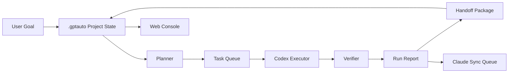

# gptauto Design Spec

## Purpose

`gptauto` is a local development orchestration platform for unattended agentic software work. It coordinates Codex CLI execution, optional Claude planning, task state, recovery handoffs, verification, reporting, and a lightweight local Web console.

The primary problem it solves is not one-off AI execution. It solves continuity: agent runs stop, conversation context fills, context compaction can stall, and planner/executor collaboration currently requires manual copy-paste. `gptauto` moves the source of truth out of chat context and into durable local project state.

## First-Version Scope

The first version is a complete local platform with a CLI execution core and a thin Web control console.

It includes:

- Local project initialization with a `.gptauto/` state directory.
- Durable task queues, run records, reports, handoffs, and decisions.
- A run loop for unattended development sessions such as overnight work.
- Codex CLI as the initial execution worker.
- A local planner fallback.
- Optional Claude planner integration when available.
- Claude sync records when Claude is unavailable.
- Verification hooks for tests, lint, type checks, git status, and git diff summaries.
- Aggressive automatic decision policy with audit records and hard safety stops.
- Local Web console for status, tasks, runs, reports, and decisions.

It does not include in the first version:

- Cloud hosting.
- Multi-user permissions.
- Multi-project distributed workers.
- Full chat UI.
- Automatic production deployment.
- Automatic force push, rebase, or git history rewrite.
- Unrestricted bulk file deletion.

## Core Principle

Any interrupted run must be recoverable from files under `.gptauto/` without relying on the current chat context.

Every run should produce enough state for a new conversation or process to continue:

- Current project goal.
- Current task state.
- Codex execution input.
- Codex output summary.
- Modified file summary.
- Verification result.
- Git diff summary or patch.
- Automatic decisions and reasons.
- Next-step recommendation.
- Handoff package.

## Architecture

`gptauto` acts as the outer orchestrator. Codex and Claude are workers, not the source of truth.



Responsibilities:

- `gptauto`: task orchestration, state persistence, scheduling, decisions, verification, reporting, and Web console.
- Codex CLI: concrete code changes, command execution, test fixes, and implementation reports.
- Claude planner: optional high-level planning when available.
- Local planner: fallback task generation when Claude is unavailable.
- User: only high-risk intervention, blocked review, or manual override.

## Project State Layout

Each target project gets a `.gptauto/` directory:

```text
.gptauto/
  config.json
  state.json
  tasks/
    queue.jsonl
    completed.jsonl
    blocked.jsonl
  runs/
    2026-05-05T230000Z/
      input.md
      codex-output.md
      verification.json
      git-diff.patch
      report.md
      handoff.md
  decisions/
    decisions.jsonl
  reports/
    overnight-2026-05-06.md
    claude-sync.jsonl
  locks/
    run.lock
```

The system uses append-friendly JSONL and per-run folders instead of one large mutable JSON file. This makes recovery, inspection, and context handoff easier.

## Core Components

### CLI

The CLI is the primary control surface for automation.

Commands:

```bash
gptauto init --project E:\my-project
gptauto goal "Complete login, registration, and user profile pages"
gptauto run --overnight --max-hours 8 --aggression aggressive
gptauto status
gptauto report --latest
gptauto web --port 4789
gptauto resume --from .gptauto/runs/latest/handoff.md
```

Command responsibilities:

- `init`: create `.gptauto/`, detect git, package manager, test commands, and Codex CLI availability.
- `goal`: store the long-term goal and generate initial tasks.
- `run`: execute the unattended run loop.
- `status`: summarize current task, latest failure, and blocked items.
- `report`: print latest run report or overnight summary.
- `web`: start the local Web console.
- `resume`: continue from a handoff file.

### Project State

Project state is the durable source of truth. It stores configuration, task queues, run records, reports, decisions, and lock files.

### Planner

The planner creates small implementation tasks from the project goal and latest run state.

Priority:

1. Claude planner if configured and available.
2. Local planner if Claude is unavailable.
3. Codex-assisted planning if local context is insufficient.

When Claude is unavailable, the planner records a Claude sync item so future Claude planning can catch up on what happened.

### Codex Executor

The executor converts each task into a precise Codex CLI prompt. It asks Codex to implement, verify, summarize changes, and report blockers in structured text.

Each task execution records:

- Prompt input.
- Codex output.
- Changed files.
- Commands run.
- Verification result.
- Run report.
- Handoff.

### Verifier

The verifier inspects the repo after each task. It should detect:

- Test results.
- Lint results.
- Type-check results.
- Git status.
- Git diff summary.
- Risk indicators such as credential edits, destructive commands, or large deletion sets.

Verification failure normally creates a repair task. Critical risk pauses the run.

### Decision Engine

The decision engine answers agent or planner choices according to policy.

The first-version default is aggressive:

- Low and medium risk decisions are auto-selected.
- High risk decisions are auto-selected if reversible and consistent with existing project patterns.
- Critical decisions pause.

Every automatic decision is written to `decisions/decisions.jsonl`.

Example:

```json
{
  "time": "2026-05-05T23:15:00Z",
  "taskId": "task_20260505_001",
  "question": "Use Vitest or Jest?",
  "choice": "Vitest",
  "reason": "The project already uses Vite, so Vitest has lower integration cost.",
  "risk": "medium",
  "reversible": true,
  "approvedBy": "policy:auto-aggressive"
}
```

Critical stop conditions:

- Bulk deletion of source or user data.
- Editing secrets, tokens, credentials, or `.env` values.
- Production deployment.
- Paid API activation.
- Large database migration.
- Git history rewrite.
- Unclear ownership of existing uncommitted changes.

### Reporter and Handoff Writer

After each run, the reporter writes a human-readable `report.md` and a continuation-focused `handoff.md`.

The handoff must include:

- Goal.
- Current task.
- Last completed task.
- Changed files.
- Test and verification status.
- Decisions made.
- Blockers.
- Recommended next action.
- Exact commands or files a new session should read first.

### Web Console

The Web console is local-only in the first version and defaults to port `4789`.

Pages:

- Dashboard: current project, current task, run status, completed/failed/blocked counts, overnight status.
- Tasks: queued, running, completed, blocked, and repair tasks; retry, unblock, cancel, and add task.
- Runs: input, output, verification, diff, report, and handoff for each run.
- Decisions: automatic decision history, risk, reason, reversibility, and future policy override.
- Reports: latest report, overnight summary, and pending Claude sync records.

The Web console is a dashboard and black box recorder. It does not edit project code and does not provide a full chat interface in the first version.

## Task Model

Example task:

```json
{
  "id": "task_20260505_001",
  "project": "my-app",
  "title": "Implement login form validation",
  "source": "claude",
  "status": "queued",
  "risk": "low",
  "attempts": 0,
  "maxAttempts": 3,
  "requiresApproval": false,
  "contextFiles": ["src/auth/Login.tsx"],
  "acceptance": [
    "Validation errors show before submit",
    "Existing auth tests pass"
  ]
}
```

Statuses:

```text
queued
planning
ready
running
verifying
completed
repair_queued
blocked
cancelled
```

Normal flow:

```text
queued -> planning -> ready -> running -> verifying -> completed
```

Repair flow:

```text
running/verifying -> repair_queued -> running
```

Blocked flow:

```text
planning/running/verifying -> blocked
```

## Unattended Run Loop

`gptauto run --overnight` performs this loop:

1. Read `.gptauto/state.json` and task queues.
2. If no task exists, generate a small batch from the planner.
3. Pick the next eligible task.
4. Generate Codex CLI prompt.
5. Run Codex.
6. Capture output, changed files, command results, and git diff.
7. Run verification commands.
8. Mark task completed if verification passes.
9. Create a repair task if verification fails.
10. Pause only on critical risk or repeated failure beyond the attempt limit.
11. Write report and handoff.
12. Continue until time, task, risk, or explicit stop limit is reached.
13. Write overnight summary.

Repeated failure policy:

- First failure: create repair task.
- Second failure: retry with narrower context and latest verifier output.
- Third failure: mark blocked and continue to another independent task if available.

## Claude Sync

Claude is optional in the first version.

When Claude is available:

```text
project goal -> Claude plan -> task queue -> Codex execution -> report -> Claude next plan
```

When Claude is unavailable:

```text
project goal -> local plan -> task queue -> Codex execution -> report -> claude-sync queue
```

Pending sync records are appended to `reports/claude-sync.jsonl`.

Example:

```json
{
  "time": "2026-05-05T23:40:00Z",
  "type": "execution_report",
  "status": "pending_sync",
  "summary": "Codex completed auth validation and added tests.",
  "changedFiles": ["src/auth/Login.tsx", "src/auth/Login.test.tsx"],
  "questionsAnsweredAutomatically": [
    {
      "question": "Use inline validation or schema validation?",
      "choice": "schema validation",
      "reason": "Existing project already uses zod."
    }
  ],
  "nextPlanUsedWithoutClaude": true
}
```

When Claude becomes available again, `gptauto` sends the pending sync records before asking for the next plan.

## Technology Stack

The first version should use Node.js and TypeScript.

Recommended packages:

- CLI: `commander`.
- Web server: `express` or `fastify`.
- Tests: `vitest`.
- File operations: Node standard library.
- Process execution: Node `child_process`.
- Web UI: static HTML, CSS, and browser JavaScript for the first version.

The Web UI can later move to React if the console grows beyond simple status and control pages.

## Repository Structure

```text
gptauto/
  package.json
  tsconfig.json
  src/
    cli/
      index.ts
      commands/
    core/
      project-state.ts
      task-queue.ts
      run-loop.ts
      decisions.ts
      reports.ts
      handoff.ts
    agents/
      codex-cli.ts
      claude-planner.ts
      local-planner.ts
    verifier/
      git.ts
      commands.ts
      risk.ts
    web/
      server.ts
      public/
        index.html
        app.js
        styles.css
  tests/
    core/
    agents/
    verifier/
  docs/
    superpowers/
      specs/
      plans/
```

## Testing Strategy

The first implementation plan should include tests for:

- `.gptauto/` initialization.
- JSONL queue append, read, and recovery.
- Task status transitions.
- Run locking.
- Codex CLI invocation failure handling.
- Verification failure turning into repair tasks.
- Automatic decision records.
- Critical risk detection.
- Handoff content completeness.
- Web API reads for dashboard, tasks, runs, decisions, and reports.

The first version should prefer deterministic unit tests and small integration tests around temporary directories. It should avoid tests that require live Codex or Claude access by default.

## Delivery Criteria

The first version is complete when a user can run:

```bash
gptauto init --project E:\some-project
gptauto goal "Build the app according to the README"
gptauto web --port 4789
gptauto run --overnight --max-hours 8 --aggression aggressive
```

And then inspect:

- Completed tasks.
- Modified files.
- Verification results.
- Automatic decisions.
- Run reports.
- Handoff files.
- Pending Claude sync records.
- Blocked items requiring user input.

## Open Design Choices Resolved

- Full product direction: complete local overnight development platform.
- Control mechanism: local CLI/API first.
- Agent strategy: Codex CLI first, Claude planner optional.
- Runtime shape: CLI execution core plus thin Web console.
- Decision policy: aggressive automation with critical hard stops.
- Architecture: event-log and file-state driven local platform.

## Implementation Order

The implementation should start with durable state, task queues, and reports before building agent integrations. This reduces the chance that Codex or Claude integration complexity hides state-management bugs.

Recommended first milestones:

1. Project scaffold and tests.
2. `.gptauto/` initialization.
3. JSONL task queue and state model.
4. Decision log and risk policy.
5. Report and handoff writer.
6. Local planner.
7. Codex CLI executor adapter.
8. Verifier.
9. Run loop.
10. Web read APIs and static console.
11. Claude sync queue.

